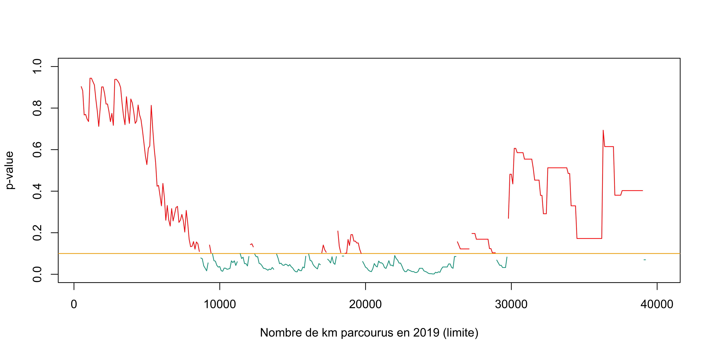

ILB dessins (français)
================
Arthur Charpentier
2022

-   [Figure 4.4](#figure-44)
-   [Figure 4.2](#figure-42)
-   [Figure 4.8](#figure-48)
-   [Figure 4.10](#figure-410)
-   [Figure 4.13](#figure-413)
-   [Figure 3.3 (1-2)](#figure-33-1-2)
-   [Figure 3.3 (3-4)](#figure-33-3-4)
-   [Figure 2.1](#figure-21)
-   [Figure 2.2](#figure-22)
-   [Figure 2.3](#figure-23)
-   [Figure 2.4](#figure-24)
-   [Figure 2.6 (1)](#figure-26-1)
-   [Figure 2.6 (2)](#figure-26-2)
-   [Figure 2.6 (3)](#figure-26-3)
-   [Figure 2.6 (4)](#figure-26-4)
-   [Figure 1.2](#figure-12)
-   [Figure 1.1](#figure-11)
-   [Figure 4.22](#figure-422)
-   [Figure 2.8](#figure-28)
-   [Figure 4.3](#figure-43)
-   [Figure 4.6](#figure-46)
-   [Figure 4.14](#figure-414)
-   [Figure 4.15](#figure-415)
-   [Figure 4.5](#figure-45)
-   [Figure 4.16](#figure-416)

``` r
library(splines)
library(wesanderson)
library(scales)
library(CASdatasets)
data(freMTPL2freq)
colr = wes_palette("Darjeeling1")
colr2 = colr[c(5,1)]
clrpal = wes_palette("Zissou1", 22, type = "continuous")
clrpallow = scales::alpha(clrpal,.4)
bleurouge = clrpal[c(1,22)]
bleurougepal = clrpallow[c(1,22)]
clrpal4 = colr =  wes_palette("Darjeeling1")[c(1,2,3,5)]
clrpal6 = wes_palette("Zissou1", 6, type = "continuous")
```

``` r
df = read.csv("/Users/arthurcharpentier/Dropbox (Télécom SudParis)/backup_mac/cyclistsTempHKI.csv")
dfts = cbind(C=ts(df$cyclists,start = c(2014, 1,2), frequency = 365), T=ts(df$meanTemp,start = c(2014, 1,2), frequency = 365))
df0 = df
n = nrow(df0)
df = data.frame(meanTemp = df0$meanTemp[1:(n-1)],
                cyclists = df0$cyclists[2:n])
```

``` r
par(mfrow=1:2)
plot(df$meanTemp,df$cyclists,,xlab="Température (°C, jour j)",
     ylab="Nombre quotidien de cyclistes (jour j+1)",axes=FALSE,col=colr2[1],pch=19,cex=.7)
axis(1)
axis(2)  
u=seq(-25,25,length=251)
reg=lm(cyclists~meanTemp,data=df,
       subset = (meanTemp>0))
lines(u,predict(reg,newdata=data.frame(meanTemp=u)),
      col=colr2[2],lwd=2)

df = data.frame(meanTemp = df0$meanTemp[2:n],
                cyclists = df0$cyclists[1:(n-1)])
plot(df$cyclists,df$meanTemp,ylab="Température (°C, jour j+1)",
     xlab="Nombre quotidien de cyclistes (jour j)",axes=FALSE,col=colr2[1],pch=19,cex=.7)
axis(1)
axis(2)  
u=seq(0,25000,length=251)
reg=lm(meanTemp~cyclists,data=df,
       subset = (meanTemp>0))
lines(u,predict(reg,newdata=data.frame(cyclists=u)),
      col=colr2[2],lwd=2)
```


``` r
# circle-square
library("wesanderson")
colr = wes_palette("Darjeeling1")
colr23 = colr[c(2,3)]
n = 24
S = (1:n)/(1+n)
P = c(rep(0,6),rep(1,4),rep(0,2),rep(1,12))
Y = c(0,0,1,0,1,1,0,0,1,0,
      1,1,0,0,0,1,1,1,1,0,
      1,1,1,1)
roc.curve.p=function(s,print=FALSE,i){
  Ps=(S[i]>s)*1
  FP=sum((Ps==1)*(Y[i]==0))/sum(Y[i]==0)
  TP=sum((Ps==1)*(Y[i]==1))/sum(Y[i]==1)
  vect=c(FP,TP)
  names(vect)=c("FPR","TPR")
  return(vect)
}
```

# Figure 4.4

``` r
par(mfrow=1:2)
plot(0:1,0:1,col="grey",xlab="Taux de faux positif",
     ylab="Taux de vrais positifs",type="l")
RC0 = Vectorize(function(s) roc.curve.p(s,i=which(P==0)))((0:1000)/1000)
lines(RC0[1,],RC0[2,],col=colr2[1])
RC1 = Vectorize(function(s) roc.curve.p(s,i=which(P==1)))((0:1000)/1000)
lines(RC1[1,],RC1[2,],col=colr2[2])

plot(0:1,0:1,col="grey",xlab="Taux de faux positif",
     ylab="Taux de vrais positifs",type="l")
a0 = c(0,0,.3333333333,1)
b0 = c(0,.8,1,1)
lines(RC0[1,],RC0[2,],col=scales::alpha(colr2[1],.4))
lines(a0,b0,col=colr2[1])
RC1 = Vectorize(function(s) roc.curve.p(s,i=which(P==1)))((0:1000)/1000)
lines(RC1[1,],RC1[2,],col=scales::alpha(colr2[2],.4))
a1 = c(0,0,0.1428571,0.8571429,1)
b1 = c(0,0.4444444,0.8888889,1,1)
lines(a1,b1,col=colr2[2])
```


``` r
roc.curve=function(s,print=FALSE){
  Ps=(S>s)*1
  FP=sum((Ps==1)*(Y==0))/sum(Y==0)
  TP=sum((Ps==1)*(Y==1))/sum(Y==1)
  M=table(Observed=Y,Predicted=factor(Ps,levels=0:1))
   if(print==TRUE){
     print(M)
     }
   vect=c(FP,TP)
   names(vect)=c("FPR","TPR")
  return(list(v=vect,m=M))
}
```

# Figure 4.2

``` r
par(mfrow=1:2)
plot(0:1,0:1,col="grey",xlab="Taux de faux positif",
     ylab="Taux de vrais positifs",type="l")
RC = Vectorize(function(s) roc.curve(s)$v)((0:1000)/1000)
i=which(diff(RC[1,])<0)
a=c(0,0,.1,.4,.5,.7,.8,1)
b=c(0,0.2857143,0.5714286,0.7142857,0.7857143,0.9285714,1,1    )
i=c(1,2,3,7,8)
polygon(a[i],b[i],col=scales::alpha(colr23[2],.4),border=colr23[2])
lines(0:1,0:1,col="grey")
lines(RC[1,],RC[2,],col=colr23[1])
points(a[2],b[2],col=colr23[1],pch=19)
points(a[3],b[3],col=colr23[1],pch=19)
points(a[7],b[7],col=colr23[1],pch=19)
text(a[2],b[2],"A",col=colr23[1],pos=3)
text(a[3],b[3],"B",col=colr23[1],pos=3)
text(a[7],b[7],"C",col=colr23[1],pos=2)

plot(0:1,0:1,col="grey",xlab="Taux de faux positif",
     ylab="Taux de vrais positifs",type="l")
lines(RC[1,],RC[2,],col=colr23[1])
abline(a=.5,b=10/14,col=colr23[2])
points(a[3],b[3],col=colr23[2],pch=19)
```


``` r
Taux_erreur_12 = function(s){
  M=roc.curve(s)$m
  (M[1,2]+M[2,1])/sum(M)
}
Taux_erreur_1 = function(s){
  M=roc.curve(s)$m
  (M[1,2])/sum(M)
}
vu = (0:1000)/1000
vv_1 = Vectorize(Taux_erreur_1)(vu)
vv_12 = Vectorize(Taux_erreur_12)(vu)
```

# Figure 4.8

``` r
par(mfrow=1:2)
plot(0:1,0:1,col="grey",xlab="Taux de faux positif",
     ylab="Taux de vrais positifs",type="l")
RC = Vectorize(function(s) roc.curve(s)$v)((0:1000)/1000)
i=which(diff(RC[1,])<0)
a=c(0,0,.1,.4,.5,.7,.8,1)
b=c(0,0.2857143,0.5714286,0.7142857,0.7857143,0.9285714,1,1    )
i=c(1,2,3,7,8)
lines(0:1,0:1,col="grey")
lines(RC[1,],RC[2,],col=colr23[1])
points(a[3],b[2],col=colr23[2],pch=19)
text(a[3],b[2],"seuil",col=colr23[1],pos=1)

plot(0:1,0:1,col="grey",xlab="Taux de faux positif",
     ylab="Taux de vrais positifs",type="l")
lines(RC[1,],RC[2,],col=colr23[1])
points(a[2],b[2],col=colr23[2],pch=19)
text(a[2],b[2],"  optimal",col=colr23[1],pos=3)
points(a[3],b[3],col=colr23[2],pch=19)
text(a[3],b[3],"équitable",col=colr23[1],pos=3)
```


# Figure 4.10

``` r
par(mfrow=1:2)
plot(vu,vv_12,type="s",ylim=c(0,.6),xlab="seuil",
     ylab="Taux d'erreur")
segments(vu,vv_1,vu,vv_12,col=scales::alpha(colr23[1],.2))
segments(vu,vv_1,vu,rep(0,1001),col=scales::alpha(colr23[2],.2))
lines(vu,vv_12,type="s")
text(0,.15,"Faux positifs",col=colr23[2],pos=4)
text(1,.15,"Faux négatifs",col=colr23[1],pos=2)
abline(v=.6+1/48,lty=2)

Taux_frac = function(s) mean(Y[(P==1)&(S>s)])/mean(Y[(P==0)&(S>s)])
Taux_frac = function(s) sum((P==0)&(S>s))/sum((P==1)&(S>s))/sum(P==0)*sum(P==1)
vv_0 = Vectorize(Taux_frac)(vu)
plot(vu,vv_0,type="s",xlab="seuil",
     ylab=
expression("P("*hat(Y)*"=1|P=0) / P("*hat(Y)*"=1|P=1)"))
abline(v=.4+1/48,lty=2)
```


``` r
par(mfrow=1:2)
FPR2=function(s,print=FALSE){
  Ps=(S[P==0]>s)*1
  FP0=sum((Ps==1)*(Y[P==0]==0))/sum(Y[P==0]==0)
  Ps=(S[P==1]>s)*1
  FP1=sum((Ps==1)*(Y[P==1]==0))/sum(Y[P==1]==0)
  vect=c(FP0,FP1)
  names(vect)=c("FPR0","FPR1")
  return(vect)
}

TPR2=function(s,print=FALSE){
  Ps=(S[P==0]>s)*1
  FP0=sum((Ps==1)*(Y[P==0]==1))/sum(Y[P==0]==1)
  Ps=(S[P==1]>s)*1
  FP1=sum((Ps==1)*(Y[P==1]==1))/sum(Y[P==1]==1)
  vect=c(FP0,FP1)
  names(vect)=c("TPR0","TPR1")
  return(vect)
}
```

# Figure 4.13

``` r
par(mfrow=c(1,2))
VF = Vectorize(FPR2)(vu)
plot(vu,VF[1,],type="s",col=colr2[1],ylab="Taux de faux positifs",
     xlab="Seuil")
lines(vu,VF[2,],type="s",col=colr2[2])

VT = Vectorize(TPR2)(vu)
plot(vu,VT[1,],type="s",col=colr2[1],ylab="Taux de vrais positifs",
     xlab="Seuil")
lines(vu,VT[2,],type="s",col=colr2[2])
```


``` r
S = 1:13
Y = c(rep(0,5),rep(1,1),rep(0,2),rep(1,5))
s=6.5

Ps=(S>s)*1
FP=sum((Ps==1)*(Y==0))/sum(Y==0)
TP=sum((Ps==1)*(Y==1))/sum(Y==1)
M=table(Observed=Y,Predicted=factor(Ps,levels=0:1))
vect=c(FP,TP)
names(vect)=c("FPR","TPR")
```

``` r
par(mfrow=1:2)
plot(0:1,0:1,col="grey",xlab="Taux de faux positif",
     ylab="Taux de vrais positifs",type="l")
vu = 0:1000/1000
vv = pbeta(vu,.4,2)
lines(vu,vv,col=colr2[1])
vv = pbeta(vu,.3,3)
lines(vu,vv,col=colr2[2])

plot(0:1,0:1,col="grey",xlab="Taux de faux positif",
     ylab="Taux de vrais positifs",type="l")
vu = c(0,.15,1)
vv = c(0,pbeta(.15,.4,2),1)
lines(vu,vv,col=colr2[1])
vu = c(0,.11,1)
vv = c(0,pbeta(.11,.3,3),1)
lines(vu,vv,col=colr2[2])
```


``` r
par(mfrow=1:2)
plot(0:1,0:1,col="grey",xlab="Taux de faux positif",
     ylab="Taux de vrais positifs",type="l")
vu = 0:1000/1000
vv = pbeta(vu,.2,1)
lines(vu,vv,col=colr2[1])
vv = pbeta(vu,.5,3)
lines(vu,vv,col=colr2[2])

plot(0:1,0:1,col="grey",xlab="Taux de faux positif",
     ylab="Taux de vrais positifs",type="l")
vu = c(0,.4,1)
vv = c(0,pbeta(.4,.2,1),1)
lines(vu,vv,col=colr2[1])
vu = c(0,.11,1)
vv = c(0,pbeta(.11,.5,3),1)
lines(vu,vv,col=colr2[2])
```


``` r
par(mfrow=1:2)
plot(0:1,0:1,col="grey",xlab="Taux de faux positif",
     ylab="Taux de vrais positifs",type="l")
vu = 0:1000/1000
vv = pbeta(vu,.2,1)
lines(vu,vv,col=colr2[1])
vv = pbeta(vu,.5,3)
lines(vu,vv,col=colr2[2])
a=uniroot(function(u) pbeta(u,.2,1)-pbeta(u,.5,3),c(.1,.9))$root
b=pbeta(a,.5,3)
points(a,b,pch=19,col=colr23[2])

plot(0:1,0:1,col="grey",xlab="Taux de faux positif",
     ylab="Taux de vrais positifs",type="l")
vu = c(0,.4,1)
vv = c(0,pbeta(.4,.2,1),1)
lines(vu,vv,col=colr2[1])
vu = c(0,.11,1)
vv = c(0,pbeta(.11,.5,3),1)
lines(vu,vv,col=colr2[2])
a=uniroot(function(u) pbeta(.11,.5,3)+(1-pbeta(.11,.5,3))/.89*(u-.11)-pbeta(.4,.2,1)/.4*u,c(.1,.5))$root
b=pbeta(.4,.2,1)/.4*a
points(a,b,pch=19,col=colr23[2])
```


``` r
set.seed(1)
n=1000
r = .6
U1 = rnorm(n)
X1 = U1*20+50
U2 = sqrt(1-r^2)*rnorm(n)+r*U1
X2 = U2*20+50
idx = (abs(X1-50)<50)&(abs(X2-50)<50)
X1=X1[idx]
X2=X2[idx]

id1A = (X1+X2-60)<=0
id1B = (X1+X2-60)>0
id2A = (X1+X2-120)<=0
id2B = (X1+X2-120)>0
id3A = (X1+X2-150)<=0
id3B = (X1+X2-150)>0
id1 = id1A
id2 = id1B&id2A
id3 = id2B&id3A
id4 = id3B
id = id1+id2*2+id3*3+id4*4
col4 = c("black",colr)
```

# Figure 3.3 (1-2)

``` r
par(mfrow=c(1,2))
library(ellipse)
plot(X1,X2,col=colr[2],xlab="GPA (échelle 0-100)",ylab="SAT (échelle 0-100)")
df = data.frame(X1,X2)
r <- princomp(df)
p = prcomp(df)
polygon(ellipse(cor(df)*(max(abs(p$rotation))*1)*400, 
                centre=colMeans(df), 
                level=0.95),border=colr[2])
b <- r$loadings[2,1] / r$loadings[1,1]
a <- r$center[2] - b * r$center[1]
xr = c(0,100)
yr = a+b*xr
segments(xr[1],yr[1],xr[2],yr[2],lwd=2,col=colr[2])
text(-2.5,95,"population totale",pos=4,cex=.7,col=colr[2])
ida = id3
plot(X1,X2,col=(colr[c(3,2)])[id3+1],xlab="GPA (échelle 0-100)",ylab="SAT (échelle 0-100)")
df = data.frame(X1,X2)[ida,]
r <- princomp(df)
p = prcomp(df)
polygon(ellipse(cor(df)*(max(abs(p$rotation))*1)*150, 
                centre=colMeans(df), 
                level=0.95),border=colr[2])
b <- r$loadings[2,1] / r$loadings[1,1]
a <- r$center[2] - b * r$center[1]
xr = c(35,100)
yr = a+b*xr
segments(xr[1],yr[1],xr[2],yr[2],lwd=2,col=colr[2])
text(-2.5,95,"population admise",pos=4,cex=.7,col=colr[2])
text(-2.5,88,"et inscrite",pos=4,cex=.7,col=colr[2])
text(100,5,"population refusée",pos=2,cex=.7,col=colr[3])
xr = c(20,110)
yr = 120-1*xr
polygon(c(xr[1],xr[2],xr[2]),c(yr[1],yr[2],yr[1])
        ,density=20,col=scales::alpha(colr[2],.6),border=NA)
```


# Figure 3.3 (3-4)

``` r
par(mfrow=c(1,2))
ida = id2B
plot(X1,X2,col=(colr[c(3,2)])[ida+1],xlab="GPA (échelle 0-100)",ylab="SAT (échelle 0-100)")
df = data.frame(X1,X2)[ida,]
r <- princomp(df)
p = prcomp(df)
polygon(ellipse(cor(df)*(max(abs(p$rotation))*1)*150, 
                centre=colMeans(df)+5, 
                level=0.95),border=colr[2])
b <- r$loadings[2,1] / r$loadings[1,1]
a <- r$center[2] - b * r$center[1]
xr = c(35,100)
yr = a+b*xr
segments(xr[1],yr[1],xr[2],yr[2],lwd=2,col=colr[2])
text(-2.5,95,"population admise",pos=4,cex=.7,col=colr[2])
text(100,5,"population refusée",pos=2,cex=.7,col=colr[3])
xr = c(20,110)
yr = 120-1*xr
polygon(c(xr[1],xr[2],xr[2]),c(yr[1],yr[2],yr[1])
        ,density=20,col=scales::alpha(colr[2],.6),border=NA)

ida = id1B
plot(X1,X2,col=(colr[c(3,2)])[ida+1],xlab="GPA (échelle 0-100)",ylab="SAT (échelle 0-100)")
df = data.frame(X1,X2)[ida,]
r <- princomp(df)
p = prcomp(df)
polygon(ellipse(cor(df)*(max(abs(p$rotation))*1)*300, 
                centre=colMeans(df)+10, 
                level=0.95),border=colr[2])
b <- r$loadings[2,1] / r$loadings[1,1]
a <- r$center[2] - b * r$center[1]
xr = c(35,100)
yr = a+b*xr
segments(xr[1],yr[1],xr[2],yr[2],lwd=2,col=colr[2])
text(-2.5,95,"population visible",pos=4,cex=.7,col=colr[2])
text(100,5,"population invisible",pos=2,cex=.7,col=colr[3])
xr = c(-10,110)
yr = 60-1*xr
polygon(c(xr[1],xr[2],xr[1]),c(yr[1],yr[2],yr[2])
        ,density=20,col=scales::alpha(colr[3],.6),border=NA)
```


``` r
loc_fichier = "http://freakonometrics.free.fr/titanic.RData"
download.file(loc_fichier, "titanic.RData")
load("titanic.RData")
#install.packages("stablelearner")
library(stablelearner)
data("titanic")

age = titanic$age
survie = titanic$survived == "yes"

M = t(table(is.na(age),survie))
M=M[,2:1]
chisq.test(M)$expected
```

    ## Warning in chisq.test(M): Chi-squared approximation may be incorrect

    ##        
    ## survie       TRUE     FALSE
    ##   FALSE 1.3556865 1494.6443
    ##   TRUE  0.6443135  710.3557

``` r
library("graphics")
library("vcd")
mosaicplot(M, gp = shading_hcl, gp_args = list(interpolate = c(1, 1.8)))
```

    ## Warning: In mosaicplot.default(M, gp = shading_hcl, gp_args = list(interpolate = c(1, 
    ##     1.8))) :
    ##  extra arguments 'gp', 'gp_args' will be disregarded


``` r
mosaicplot(M, shade=TRUE)
```


``` r
assoc(M,shade = TRUE)
```


``` r
hist(age[survie==0],probability = TRUE,col=scales::alpha(colr[2],.4),
     border=NA,main="",xlab="âge")
hist(age[survie==1],probability = TRUE,col=scales::alpha(colr[3],.4),
     border=NA,add=TRUE)
lines(density(age[survie==0],na.rm=TRUE),lwd=3,col=colr[2])
lines(density(age[survie==1],na.rm=TRUE),lwd=3,col=colr[3])
legend("topright",c("décès","survie"),col=colr[2:3],lwd=3,bty="n")
```


``` r
genre = titanic$gender
survie = titanic$survived
classe = titanic$class
levels(classe)=c("1st","2nd","3rd","crew","crew","crew","crew")
table(classe)
```

    ## classe
    ##  1st  2nd  3rd crew 
    ##  324  284  709  890

``` r
table(classe,survie)/as.numeric(table(classe))*100
```

    ##       survie
    ## classe       no      yes
    ##   1st  37.96296 62.03704
    ##   2nd  58.45070 41.54930
    ##   3rd  74.47109 25.52891
    ##   crew 76.29213 23.70787

``` r
table(classe,survie,genre)[,,"female"]/as.numeric(table(classe[genre=="female"]))*100
```

    ##       survie
    ## classe        no       yes
    ##   1st   3.472222 96.527778
    ##   2nd  11.320755 88.679245
    ##   3rd  50.925926 49.074074
    ##   crew 13.043478 86.956522

``` r
table(classe,survie,genre)[,,"male"]/as.numeric(table(classe[genre=="male"]))*100
```

    ##       survie
    ## classe       no      yes
    ##   1st  65.55556 34.44444
    ##   2nd  86.51685 13.48315
    ##   3rd  84.78702 15.21298
    ##   crew 77.97001 22.02999

``` r
table(classe,survie)
```

    ##       survie
    ## classe  no yes
    ##   1st  123 201
    ##   2nd  166 118
    ##   3rd  528 181
    ##   crew 679 211

``` r
as.numeric(table(classe))
```

    ## [1] 324 284 709 890

``` r
table(classe,survie,genre)[,,"female"]/as.numeric(table(classe[genre=="female"]))*100
```

    ##       survie
    ## classe        no       yes
    ##   1st   3.472222 96.527778
    ##   2nd  11.320755 88.679245
    ##   3rd  50.925926 49.074074
    ##   crew 13.043478 86.956522

``` r
table(classe,survie,genre)[,,"male"]/as.numeric(table(classe[genre=="male"]))*100
```

    ##       survie
    ## classe       no      yes
    ##   1st  65.55556 34.44444
    ##   2nd  86.51685 13.48315
    ##   3rd  84.78702 15.21298
    ##   crew 77.97001 22.02999

``` r
mean(genre)
```

    ## Warning in mean.default(genre): argument is not numeric or logical: returning NA

    ## [1] NA

``` r
library(tidyverse)
```

    ## ── Attaching packages ─────────────────────────────────────── tidyverse 1.3.1 ──

    ## ✓ tibble  3.1.6     ✓ purrr   0.3.4
    ## ✓ readr   2.1.1     ✓ forcats 0.5.1

    ## ── Conflicts ────────────────────────────────────────── tidyverse_conflicts() ──
    ## x readr::col_factor() masks scales::col_factor()
    ## x dplyr::collapse()   masks nlme::collapse()
    ## x purrr::discard()    masks scales::discard()
    ## x tidyr::extract()    masks raster::extract()
    ## x dplyr::filter()     masks stats::filter()
    ## x dplyr::first()      masks xts::first()
    ## x dplyr::lag()        masks stats::lag()
    ## x dplyr::last()       masks xts::last()
    ## x raster::select()    masks dplyr::select()

``` r
load("~/Dropbox (Télécom SudParis)/donnees_telematiques/Output/Data/France/claims.rda")
load("~/Dropbox (Télécom SudParis)/donnees_telematiques/Output/Data/France/contracts.rda")
load("~/Dropbox (Télécom SudParis)/donnees_telematiques/Output/Data/France/telematics_data.rda")

contracts <- read_csv2("~/Dropbox (Télécom SudParis)/donnees_telematiques/Data/telematics_france/donnees_contrats_202010.csv",
                       col_types = 
                         cols(
                           .default = col_character(),
                           nocnt = col_character(),
                           noavt = col_double(),
                           nomaj = col_double(),
                           ddebeff = col_double(),
                           dfineff = col_character(),
                           csit = col_character(),
                           ageref = col_double(),
                           ccsp = col_character(),
                           mcotanht = col_number(),
                           mcotanttc = col_number(),
                           nivfrch = col_character(),
                           mparking = col_double(),
                           cform = col_character(),
                           cpost = col_character(),
                           dnais = col_double(),
                           genre = col_character(),
                           csitfam = col_character(),
                           txbmec = col_number(),
                           typconv = col_character(),
                           agepermis = col_number(),
                           cdmarque = col_character(),
                           cdmodel = col_character(),
                           cgta = col_character(),
                           clasprix = col_character(),
                           clasrepr = col_character(),
                           energie = col_character(),
                           groupsra = col_double(),
                           typhabits = col_character(),
                           zonetrf = col_character(),
                           zonetrfbdg = col_character(),
                           zonetrfvol = col_character(),
                           cusg = col_character()
                         )
)
```

    ## ℹ Using "','" as decimal and "'.'" as grouping mark. Use `read_delim()` for more control.

``` r
dim(contracts)
```

    ## [1] 29275    32

``` r
telematics_data_path <- list.files(path = "~/Dropbox (Télécom SudParis)/donnees_telematiques/Data/telematics_france/", 
                                   pattern = "^donnees_telematiques_(.*?)\\.csv", full.names = TRUE)
length(telematics_data_path)
```

    ## [1] 41

``` r
load_telematics_data <- function(x){
  B = read_csv2(x, col_types = cols(
    .default = col_double(),
    UnitId = col_character(),
    nocnt10 = col_character(),
    AccelerationScore = col_number(),
    BrakingScore = col_number(),
    CorneringScore = col_number(),
    DrivingStyleScore = col_number(),
    TimeOfDayFactor = col_number(),
    DrivingStyleFactor = col_number(),
    DistanceFactor = col_number()
  ))
  year_base <- str_sub(x, -10, -7) %>% as.numeric()
  month_base <- str_sub(x, -6, -5) %>% as.numeric()
  B$year = year_base
  B$month = month_base
  B$id = B$nocnt10
  return(B)
}

telematics_data <- map_df(telematics_data_path, load_telematics_data)
```

    ## ℹ Using "','" as decimal and "'.'" as grouping mark. Use `read_delim()` for more control.

    ## ℹ Using "','" as decimal and "'.'" as grouping mark. Use `read_delim()` for more control.
    ## ℹ Using "','" as decimal and "'.'" as grouping mark. Use `read_delim()` for more control.
    ## ℹ Using "','" as decimal and "'.'" as grouping mark. Use `read_delim()` for more control.
    ## ℹ Using "','" as decimal and "'.'" as grouping mark. Use `read_delim()` for more control.
    ## ℹ Using "','" as decimal and "'.'" as grouping mark. Use `read_delim()` for more control.
    ## ℹ Using "','" as decimal and "'.'" as grouping mark. Use `read_delim()` for more control.
    ## ℹ Using "','" as decimal and "'.'" as grouping mark. Use `read_delim()` for more control.
    ## ℹ Using "','" as decimal and "'.'" as grouping mark. Use `read_delim()` for more control.
    ## ℹ Using "','" as decimal and "'.'" as grouping mark. Use `read_delim()` for more control.
    ## ℹ Using "','" as decimal and "'.'" as grouping mark. Use `read_delim()` for more control.
    ## ℹ Using "','" as decimal and "'.'" as grouping mark. Use `read_delim()` for more control.
    ## ℹ Using "','" as decimal and "'.'" as grouping mark. Use `read_delim()` for more control.
    ## ℹ Using "','" as decimal and "'.'" as grouping mark. Use `read_delim()` for more control.
    ## ℹ Using "','" as decimal and "'.'" as grouping mark. Use `read_delim()` for more control.
    ## ℹ Using "','" as decimal and "'.'" as grouping mark. Use `read_delim()` for more control.
    ## ℹ Using "','" as decimal and "'.'" as grouping mark. Use `read_delim()` for more control.
    ## ℹ Using "','" as decimal and "'.'" as grouping mark. Use `read_delim()` for more control.
    ## ℹ Using "','" as decimal and "'.'" as grouping mark. Use `read_delim()` for more control.
    ## ℹ Using "','" as decimal and "'.'" as grouping mark. Use `read_delim()` for more control.
    ## ℹ Using "','" as decimal and "'.'" as grouping mark. Use `read_delim()` for more control.
    ## ℹ Using "','" as decimal and "'.'" as grouping mark. Use `read_delim()` for more control.
    ## ℹ Using "','" as decimal and "'.'" as grouping mark. Use `read_delim()` for more control.
    ## ℹ Using "','" as decimal and "'.'" as grouping mark. Use `read_delim()` for more control.
    ## ℹ Using "','" as decimal and "'.'" as grouping mark. Use `read_delim()` for more control.
    ## ℹ Using "','" as decimal and "'.'" as grouping mark. Use `read_delim()` for more control.
    ## ℹ Using "','" as decimal and "'.'" as grouping mark. Use `read_delim()` for more control.
    ## ℹ Using "','" as decimal and "'.'" as grouping mark. Use `read_delim()` for more control.
    ## ℹ Using "','" as decimal and "'.'" as grouping mark. Use `read_delim()` for more control.
    ## ℹ Using "','" as decimal and "'.'" as grouping mark. Use `read_delim()` for more control.
    ## ℹ Using "','" as decimal and "'.'" as grouping mark. Use `read_delim()` for more control.
    ## ℹ Using "','" as decimal and "'.'" as grouping mark. Use `read_delim()` for more control.
    ## ℹ Using "','" as decimal and "'.'" as grouping mark. Use `read_delim()` for more control.
    ## ℹ Using "','" as decimal and "'.'" as grouping mark. Use `read_delim()` for more control.
    ## ℹ Using "','" as decimal and "'.'" as grouping mark. Use `read_delim()` for more control.
    ## ℹ Using "','" as decimal and "'.'" as grouping mark. Use `read_delim()` for more control.
    ## ℹ Using "','" as decimal and "'.'" as grouping mark. Use `read_delim()` for more control.
    ## ℹ Using "','" as decimal and "'.'" as grouping mark. Use `read_delim()` for more control.
    ## ℹ Using "','" as decimal and "'.'" as grouping mark. Use `read_delim()` for more control.
    ## ℹ Using "','" as decimal and "'.'" as grouping mark. Use `read_delim()` for more control.
    ## ℹ Using "','" as decimal and "'.'" as grouping mark. Use `read_delim()` for more control.

``` r
stelematics_data = telematics_data[,c("id","year","month","TotalDriveDistance")]
stelematics_data = stelematics_data[stelematics_data$year == 2019,]
A1 = aggregate(x = stelematics_data$TotalDriveDistance,
               by = list(stelematics_data$id),
               sum) 
names(A1) = c("id","TotalDriveDistance")
A1$TotalDriveDistance=A1$TotalDriveDistance/1000

A21 = aggregate(x = stelematics_data$month,
                by = list(stelematics_data$id),
                max) 
A22 = aggregate(x = stelematics_data$month,
                by = list(stelematics_data$id),
                min) 
A2 = cbind(A21,A22$x)
A2$d = A2[,2]-A2[,3]
id = which(A2$d==11)

A3 = A1[id,]

B = contracts[,c("nocnt","dnais","genre")]
names(B) = c("id_contract","insured_birthdate","insured_gender")
B$id = substr(B$id_contract,6,nchar(B$id_contract))
B$age = as.numeric((as.Date("2019-01-01")-
           as.Date(as.character(B$insured_birthdate),"%Y%m%d"))/365.25)
C1= merge(A3,B[,c("id","insured_gender","age")])
C2 = C1[!is.na(C1[,4]),]
C3 = unique(C2)

D = claims[,c("id","dtsursin")]
D = D[substr(D$dtsursin,1,4)==2019,]
C3$sin = 0
C3$sin[C3$id %in% D$id] = 1
C3 = C3[C3$TotalDriveDistance>100,]
```

# Figure 2.1

``` r
library("wesanderson")
colr = wes_palette("Darjeeling1")
colr2 = colr[c(5,1)]
par(mfrow=c(1,2))
id = which(C3$insured_gender == "M")
plot(C3$TotalDriveDistance[id],C3$age[id],
     xlab="Nombre de km parcourus en 2019 (Hommes)",
     ylab="âge au 1er janvier 2019",
     col=colr2[1+(C3$sin[id]>0)],
     cex=.7,xlim=c(0,52000),
     ylim=c(18,65))
id = which(C3$insured_gender == "F")
plot(C3$TotalDriveDistance[id],C3$age[id],
     xlab="Nombre de km parcourus en 2019 (Femmes)",
     ylab="âge au 1er janvier 2019",
     col=colr2[1+(C3$sin[id]>0)],
     cex=.7,xlim=c(0,52000),
     ylim=c(18,65))
```


``` r
library(rpart)
BASE = C3[,c("sin","TotalDriveDistance","insured_gender","age")]

rpart(sin~., data=BASE[,c("sin","age","insured_gender")],cp = 0.007)
```

    ## n= 1177 
    ## 
    ## node), split, n, deviance, yval
    ##       * denotes terminal node
    ## 
    ##  1) root 1177 136.790100 0.13423960  
    ##    2) age>=18.94182 1130 126.393800 0.12831860  
    ##      4) age< 19.51403 79   1.949367 0.02531646 *
    ##      5) age>=19.51403 1051 123.543300 0.13606090  
    ##       10) age>=22.98973 587  56.238500 0.10732540 *
    ##       11) age< 22.98973 464  66.206900 0.17241380 *
    ##    3) age< 18.94182 47   9.404255 0.27659570 *

``` r
BASE2 = data.frame(Y = BASE$sin,
                   A = cut(as.numeric(BASE$age),c(18,20,25,100)),
                   D = cut(BASE$TotalDriveDistance,c(0,10000,20000,Inf)),
                   G= BASE$insured_gender)
(T1 = table(BASE2$A))
```

    ## 
    ##  (18,20]  (20,25] (25,100] 
    ##      202      529      446

``` r
(T2 = table(BASE2$A,BASE2$G))
```

    ##           
    ##              F   M
    ##   (18,20]   69 133
    ##   (20,25]  229 300
    ##   (25,100] 185 261

``` r
round(cbind(100*T2[,1]/T1,100*T2[,2]/T1),1)
```

    ##          [,1] [,2]
    ## (18,20]  34.2 65.8
    ## (20,25]  43.3 56.7
    ## (25,100] 41.5 58.5

``` r
(T3 = table(BASE2$A[BASE2$Y==1]))
```

    ## 
    ##  (18,20]  (20,25] (25,100] 
    ##       26       83       49

``` r
(T4 = table(BASE2$A[BASE2$Y==1],BASE2$G[BASE2$Y==1]))  
```

    ##           
    ##             F  M
    ##   (18,20]   3 23
    ##   (20,25]  34 49
    ##   (25,100] 25 24

``` r
round(T3/T1*100,1)
```

    ## 
    ##  (18,20]  (20,25] (25,100] 
    ##     12.9     15.7     11.0

``` r
round(T4/T2*100,1)
```

    ##           
    ##               F    M
    ##   (18,20]   4.3 17.3
    ##   (20,25]  14.8 16.3
    ##   (25,100] 13.5  9.2

``` r
(T1 = table(BASE2$D))
```

    ## 
    ##     (0,1e+04] (1e+04,2e+04]   (2e+04,Inf] 
    ##           550           504           123

``` r
(T2 = table(BASE2$D,BASE2$G))
```

    ##                
    ##                   F   M
    ##   (0,1e+04]     256 294
    ##   (1e+04,2e+04] 191 313
    ##   (2e+04,Inf]    36  87

``` r
round(cbind(100*T2[,1]/T1,100*T2[,2]/T1),1)
```

    ##               [,1] [,2]
    ## (0,1e+04]     46.5 53.5
    ## (1e+04,2e+04] 37.9 62.1
    ## (2e+04,Inf]   29.3 70.7

``` r
(T3 = table(BASE2$D[BASE2$Y==1]))
```

    ## 
    ##     (0,1e+04] (1e+04,2e+04]   (2e+04,Inf] 
    ##            57            74            27

``` r
(T4 = table(BASE2$D[BASE2$Y==1],BASE2$G[BASE2$Y==1]))  
```

    ##                
    ##                  F  M
    ##   (0,1e+04]     25 32
    ##   (1e+04,2e+04] 29 45
    ##   (2e+04,Inf]    8 19

``` r
round(T3/T1*100,1)
```

    ## 
    ##     (0,1e+04] (1e+04,2e+04]   (2e+04,Inf] 
    ##          10.4          14.7          22.0

``` r
round(T4/T2*100,1)
```

    ##                
    ##                    F    M
    ##   (0,1e+04]      9.8 10.9
    ##   (1e+04,2e+04] 15.2 14.4
    ##   (2e+04,Inf]   22.2 21.8

``` r
sum(BASE2$Y==1)
```

    ## [1] 158

``` r
(T1 = table(BASE2$G))
```

    ## 
    ##   F   M 
    ## 483 694

``` r
(table(BASE2$G[BASE2$Y==1]))
```

    ## 
    ##  F  M 
    ## 62 96

``` r
(table(BASE2$G[BASE2$Y==1]))/table(BASE2$G)*100
```

    ## 
    ##        F        M 
    ## 12.83644 13.83285

# Figure 2.2

``` r
par(mfrow=c(1,2))

id = (BASE2$G=="M")
p1 = mean((BASE2$Y[id]==1))
n1 = sum(id==1)
p2 = mean((BASE2$Y[!id]==1))
n2 = sum(id==0)
u1 = (0:n1)  
u2 = (0:n2)
plot(u1/n1*100,n1/100*dbinom(u1,size = n1,prob = p1),xlim=c(0,30),type="s",col=colr[3],
     xlab="Proportion du portefeuille sinistré (%)",ylab="",ylim=c(0,.387),axes=FALSE)
axis(1)
lines(u2/n2*100,n2/100*dbinom(u2,size = n2,prob = p2),type="s",col=colr[2])
legend("topleft","Hommes",
       col=colr[3],lwd=1,bty="n",cex=.7)

id = (BASE2$G=="M")&(BASE2$A!="(25,100]")
p1 = mean((BASE2$Y[id]==1))
n1 = sum(id==1)
p2 = mean((BASE2$Y[!id]==1))
n2 = sum(id==0)
u1 = (0:n1)  
u2 = (0:n2)
plot(u1/n1*100,n1/100*dbinom(u1,size = n1,prob = p1),xlim=c(0,30),
     type="s",col=colr[3],
     xlab="Proportion du portefeuille sinistré (%)",ylab="",ylim=c(0,.387),axes=FALSE)
axis(1)
lines(u2/n2*100,n2/100*dbinom(u2,size = n2,prob = p2),type="s",col=colr[2])
legend("topleft","Hommes de moins de 25 ans",
       col=colr[3],lwd=1,bty="n",cex=.7)
```


``` r
M=matrix(c(table(BASE2$Y[BASE2$G=="M"]),
           table(BASE2$Y[BASE2$G=="F"])),2,2)
colnames(M)=c("M","F")
rownames(M)=c("no","yes")
prop.test(t(M)[,2:1])
```

    ## 
    ##  2-sample test for equality of proportions with continuity correction
    ## 
    ## data:  t(M)[, 2:1]
    ## X-squared = 0.16511, df = 1, p-value = 0.6845
    ## alternative hypothesis: two.sided
    ## 95 percent confidence interval:
    ##  -0.03115699  0.05108527
    ## sample estimates:
    ##    prop 1    prop 2 
    ## 0.1383285 0.1283644

``` r
id = (BASE2$G=="M")&(BASE2$A!="(25,100]")
M=matrix(c(table(BASE2$Y[id]),
           table(BASE2$Y[!id])),2,2)
colnames(M)=c("M","F")
rownames(M)=c("no","yes")
prop.test(t(M)[,2:1])
```

    ## 
    ##  2-sample test for equality of proportions with continuity correction
    ## 
    ## data:  t(M)[, 2:1]
    ## X-squared = 5.6231, df = 1, p-value = 0.01773
    ## alternative hypothesis: two.sided
    ## 95 percent confidence interval:
    ##  0.006938098 0.094442617
    ## sample estimates:
    ##    prop 1    prop 2 
    ## 0.1662818 0.1155914

``` r
library(rpart)
A = rpart(sin ~ age+insured_gender, data=BASE, method = "class")
```

``` r
M = with(BASE,table(sin,insured_gender))
chisq.test(M)
```

    ## 
    ##  Pearson's Chi-squared test with Yates' continuity correction
    ## 
    ## data:  M
    ## X-squared = 0.16511, df = 1, p-value = 0.6845

``` r
M=with(BASE,table(sin,insured_gender,cut(age,c(0,26,100))))
M2=cbind(M[,,1],M[,,2])
chisq.test(M2)
```

    ## 
    ##  Pearson's Chi-squared test
    ## 
    ## data:  M2
    ## X-squared = 10.791, df = 3, p-value = 0.01291

``` r
M2[2,]/(M2[1,]+M2[2,])->P
round(100*P[c(1,3,2,4)],1)
```

    ##    F    F    M    M 
    ## 12.3 13.9 16.9  8.2

``` r
M=with(BASE,table(sin,insured_gender,cut(TotalDriveDistance,c(0,1e4,1e6))))
M2=cbind(M[,,1],M[,,2])
chisq.test(M2)
```

    ## 
    ##  Pearson's Chi-squared test
    ## 
    ## data:  M2
    ## X-squared = 8.4786, df = 3, p-value = 0.03709

``` r
M2[2,]/(M2[1,]+M2[2,])->P
round(100*P[c(1,3,2,4)],1)
```

    ##    F    F    M    M 
    ##  9.8 16.3 10.9 16.0

``` r
par(mfrow=c(1,2))
pv = function(a){
  M=with(BASE,table(sin,insured_gender,cut(age,c(0,a,100))))
  M2=cbind(M[,,1],M[,,2])
  chisq.test(M2)$p.value
}
va=seq(22,60,by=.1)
vpv=Vectorize(pv)(va)
```

``` r
plot(va,vpv,type="l",ylim=c(0,1),ylab="p-value",
     xlab="âge au 1er janvier 2019 (limite)",col="white")
abline(h=.1,col=colr[3])
v=rep(NA,length(va))
i=which(vpv<.1)
v[i]=vpv[i]
lines(va,v,col=colr[2])
v=rep(NA,length(va))
i=which(vpv>=.1)
v[i]=vpv[i]
lines(va,v,col=colr[1])
```


``` r
pv = function(a){
  M=with(BASE,table(sin,insured_gender,cut(TotalDriveDistance,c(0,a,1e6))))
  M2=cbind(M[,,1],M[,,2])
  chisq.test(M2)$p.value
}
va= seq(500,40000,by=100)
vpv=Vectorize(pv)(va)
```

``` r
plot(va,vpv,type="l",ylim=c(0,1),ylab="p-value",
     xlab="Nombre de km parcourus en 2019 (limite)",col="white")
abline(h=.1,col=colr[3])
v=rep(NA,length(va))
i=which(vpv<.1)
v[i]=vpv[i]
lines(va,v,col=colr[2])
v=rep(NA,length(va))
i=which(vpv>=.1)
v[i]=vpv[i]
lines(va,v,col=colr[1])
```



# Figure 2.3

``` r
library(mgcv)
par(mfrow=c(1,2))

regH = gam(sin ~ cut(age,c(17,21,26,100)), data=BASE, subset = BASE$insured_gender=="M",
           family = binomial("logit"))
regF = gam(sin ~ cut(age,c(17,21,26,100)), data=BASE, subset = BASE$insured_gender=="F",
           family = binomial("logit"))
va = seq(18,65,by=.001)
pH <- predict(regH, newdata=data.frame(age=va), 
              type = "response", se.fit = TRUE)
uprH <- pH$fit + (2 * pH$se.fit)
lwrH <- pH$fit - (2 * pH$se.fit)
pF <- predict(regF, newdata=data.frame(age=va), 
              type = "response", se.fit = TRUE)
uprF <- pF$fit + (2 * pF$se.fit)
lwrF <- pF$fit - (2 * pF$se.fit)
plot(va,pH$fit*100,ylim=c(0,.3)*100,col="white",xlab="xx",
     ylab="probabilité d'accident (en %)",axes=FALSE)
axis(1)
axis(2)
abline(v=c(21,26),col="grey")
polygon(c(va,rev(va)),c(uprH,rev(lwrH))*100,
        col=scales::alpha(colr[3],.4),border=NA)
lines(va,pH$fit*100 ,lwd=2,col=colr[3])
polygon(c(va,rev(va)),c(uprF,rev(lwrF))*100,
        col=scales::alpha(colr[2],.4),border=NA)
lines(va,pF$fit*100 ,lwd=2,col=colr[2])
legend("topright",c("Hommes","Femmes"),
       col=colr[c(3,2)],pch=15,bty="n",cex=.7)

regH = gam(sin ~ s(age), data=BASE, subset = BASE$insured_gender=="M",
           family = binomial("logit"))
regF = gam(sin ~ s(age), data=BASE, subset = BASE$insured_gender=="F",
           family = binomial("logit"))
va = seq(18,65,by=.01)
pH <- predict(regH, newdata=data.frame(age=va), 
              type = "response", se.fit = TRUE)
uprH <- pH$fit + (2 * pH$se.fit)
lwrH <- pH$fit - (2 * pH$se.fit)
pF <- predict(regF, newdata=data.frame(age=va), 
              type = "response", se.fit = TRUE)
uprF <- pF$fit + (2 * pF$se.fit)
lwrF <- pF$fit - (2 * pF$se.fit)
plot(va,pH$fit*100,ylim=c(0,.3)*100,col="white",xlab="Nombre de km parcourus en 2019",
     ylab="probabilité d'accident (en %)",axes=FALSE)
axis(1)
axis(2)
polygon(c(va,rev(va)),c(uprH,rev(lwrH))*100,
        col=scales::alpha(colr[3],.4),border=NA)
lines(va,pH$fit*100 ,lwd=2,col=colr[3])
polygon(c(va,rev(va)),c(uprF,rev(lwrF))*100,
        col=scales::alpha(colr[2],.4),border=NA)
lines(va,pF$fit*100 ,lwd=2,col=colr[2])
```


# Figure 2.4

``` r
library(mgcv)

par(mfrow=c(1,2))

regH = gam(sin ~ cut(TotalDriveDistance,c(0,1e4,2e4,1e6)), data=BASE, subset = BASE$insured_gender=="M",
           family = binomial("logit"))
regF = gam(sin ~ cut(TotalDriveDistance,c(0,1e4,2e4,1e6)), data=BASE, subset = BASE$insured_gender=="F",
           family = binomial("logit"))
va = 10^(seq(1,4.7,length=601))
pH <- predict(regH, newdata=data.frame(TotalDriveDistance=va), 
              type = "response", se.fit = TRUE)
uprH <- pH$fit + (2 * pH$se.fit)
lwrH <- pH$fit - (2 * pH$se.fit)
pF <- predict(regF, newdata=data.frame(TotalDriveDistance=va), 
              type = "response", se.fit = TRUE)
uprF <- pF$fit + (2 * pF$se.fit)
lwrF <- pF$fit - (2 * pF$se.fit)
plot(va,pH$fit*100,ylim=c(0,.3)*100,col="white",xlab="Nombre de km parcourus en 2019",
     ylab="probabilité d'accident (en %)",axes=FALSE,log="x")
axis(1)
axis(2)
abline(v=c(1e4,2e4),col="grey")
polygon(c(va,rev(va)),c(uprH,rev(lwrH))*100,
        col=scales::alpha(colr[3],.4),border=NA)
lines(va,pH$fit*100 ,lwd=2,col=colr[3])
polygon(c(va,rev(va)),c(uprF,rev(lwrF))*100,
        col=scales::alpha(colr[2],.4),border=NA)
lines(va,pF$fit*100 ,lwd=2,col=colr[2])
legend("topleft",c("Hommes","Femmes"),
       col=colr[c(3,2)],pch=15,bty="n",cex=.7)

regH = gam(sin ~ s((TotalDriveDistance)), data=BASE, subset = BASE$insured_gender=="M",
           family = binomial("logit"))
regF = gam(sin ~ s((TotalDriveDistance)), data=BASE, subset = BASE$insured_gender=="F",
           family = binomial("logit"))
va = 10^(seq(1,4.7,length=601))
pH <- predict(regH, newdata=data.frame(TotalDriveDistance=va), 
              type = "response", se.fit = TRUE)
uprH <- pH$fit + (2 * pH$se.fit)
lwrH <- pH$fit - (2 * pH$se.fit)
pF <- predict(regF, newdata=data.frame(TotalDriveDistance=va), 
              type = "response", se.fit = TRUE)
uprF <- pF$fit + (2 * pF$se.fit)
lwrF <- pF$fit - (2 * pF$se.fit)
plot(va,pH$fit*100,ylim=c(0,.3)*100,col="white",xlab="",
     ylab="probabilité d'accident (en %)",axes=FALSE,log="x")
axis(1)
axis(2)
polygon(c(va,rev(va)),c(uprH,rev(lwrH))*100,
        col=scales::alpha(colr[3],.4),border=NA)
lines(va,pH$fit*100 ,lwd=2,col=colr[3])
polygon(c(va,rev(va)),c(uprF,rev(lwrF))*100,
        col=scales::alpha(colr[2],.4),border=NA)
lines(va,pF$fit*100 ,lwd=2,col=colr[2])
```


``` r
par(mfrow=c(1,2))

regH = gam(sin ~ cut(TotalDriveDistance,c(0,1e4,2e4,1e6)), data=BASE, subset = BASE$insured_gender=="M",
           family = binomial("logit"))
regF = gam(sin ~ cut(TotalDriveDistance,c(0,1e4,2e4,1e6)), data=BASE, subset = BASE$insured_gender=="F",
           family = binomial("logit"))
va = seq(500,40000,by=50)
pH <- predict(regH, newdata=data.frame(TotalDriveDistance=va), 
              type = "response", se.fit = TRUE)
uprH <- pH$fit + (2 * pH$se.fit)
lwrH <- pH$fit - (2 * pH$se.fit)
pF <- predict(regF, newdata=data.frame(TotalDriveDistance=va), 
              type = "response", se.fit = TRUE)
uprF <- pF$fit + (2 * pF$se.fit)
lwrF <- pF$fit - (2 * pF$se.fit)
plot(va,pH$fit*100,ylim=c(0,.3)*100,col="white",xlab="Nombre de km parcourus en 2019",
     ylab="probabilité d'accident (en %)",axes=FALSE)
axis(1)
axis(2)
abline(v=c(1e4,2e4),col="grey")
polygon(c(va,rev(va)),c(uprH,rev(lwrH))*100,
        col=scales::alpha(colr[3],.4),border=NA)
lines(va,pH$fit*100 ,lwd=2,col=colr[3])
polygon(c(va,rev(va)),c(uprF,rev(lwrF))*100,
        col=scales::alpha(colr[2],.4),border=NA)
lines(va,pF$fit*100 ,lwd=2,col=colr[2])
legend("topleft",c("Hommes","Femmes"),
       col=colr[c(3,2)],pch=15,bty="n",cex=.7)

regH = gam(sin ~ s((TotalDriveDistance)), data=BASE, subset = BASE$insured_gender=="M",
           family = binomial("logit"))
regF = gam(sin ~ s((TotalDriveDistance)), data=BASE, subset = BASE$insured_gender=="F",
           family = binomial("logit"))
pH <- predict(regH, newdata=data.frame(TotalDriveDistance=va), 
              type = "response", se.fit = TRUE)
uprH <- pH$fit + (2 * pH$se.fit)
lwrH <- pH$fit - (2 * pH$se.fit)
pF <- predict(regF, newdata=data.frame(TotalDriveDistance=va), 
              type = "response", se.fit = TRUE)
uprF <- pF$fit + (2 * pF$se.fit)
lwrF <- pF$fit - (2 * pF$se.fit)
plot(va,pH$fit*100,ylim=c(0,.3)*100,col="white",xlab="Nombre de km parcourus en 2019",
     ylab="probabilité d'accident (en %)",axes=FALSE,log="x")
axis(1)
axis(2)
polygon(c(va,rev(va)),c(uprH,rev(lwrH))*100,
        col=scales::alpha(colr[3],.4),border=NA)
lines(va,pH$fit*100 ,lwd=2,col=colr[3])
polygon(c(va,rev(va)),c(uprF,rev(lwrF))*100,
        col=scales::alpha(colr[2],.4),border=NA)
lines(va,pF$fit*100 ,lwd=2,col=colr[2])
```


``` r
XF = BASE$age[BASE$sin==1]
XM = BASE$age[BASE$sin==0]
sXF = sort(XF)
sXM = sort(XM)
plot(sXF,(1:length(XF))/(1+length(XF)),type="s",col=colr[1],
     xlab="âge au 1er janvier 2019",ylab="Probabilités cumulées")
lines(sXM,(1:length(XM))/(1+length(XM)),type="s",col=colr[2])
legend("bottomright",
       c("Sinistrés","Non sinistrés"),
       col=colr[c(1,2)],pch=15,bty="n",cex=.7)

XF = BASE$TotalDriveDistance[BASE$sin==1]
XM = BASE$TotalDriveDistance[BASE$sin==0]
sXF = sort(XF)
sXM = sort(XM)
plot(sXF,(1:length(XF))/(1+length(XF)),type="s",col=colr[1],
     xlab="Nombre de km parcourus en 2019",ylab="Probabilités cumulées")
lines(sXM,(1:length(XM))/(1+length(XM)),type="s",col=colr[2])
legend("bottomright",
       c("Sinistrés","Non sinistrés"),
       col=colr[c(1,2)],pch=15,bty="n",cex=.7)
```


``` r
library(readxl)
library(dplyr)
library(stringr)
# Fichier spatial
library(spdep)
library(raster)
library(maptools)
library(compositions)
library(classInt)
library(RColorBrewer)
#library(trifield)
library(ineq)
#library(aplpack)
library(sp)
library(ggplot2)
library(tidyr)
pc = "laptop"

#setwd("/Users/UQAM/Documents/")
if(pc == "UQAM") setwd("/Users/UQAM/Dropbox (Télécom SudParis)/Belz_Charpentier__Correlation_Compositional/Donnees/")
if(pc == "laptop") setwd("~/Dropbox (Télécom SudParis)/Belz_Charpentier__Correlation_Compositional/Donnees/")
#Revenu
Revenu <- read_excel("REVENU_DEC_IRIS_2014_INSEE.xls",sheet=1,skip=5)
Revenu$DEP = str_sub(Revenu$COM,0,2)
Revenu <- Revenu %>% filter(DEP=="75")
Revenu$IRIS=as.integer(Revenu$IRIS)
Revenu$COM=as.integer(Revenu$COM)
Revenu$T_Impot = Revenu$DEC_PIMP14
Revenu$T_Pauv = Revenu$DEC_TP6014
Revenu$Mediane = Revenu$DEC_MED14

R_etude = Revenu %>% dplyr::select(IRIS,COM,LIBIRIS,LIBCOM,T_Impot,T_Pauv,Mediane)
dim(R_etude)
```

    ## [1] 868   7

``` r
#Activite
#Activite <- read_excel("/Users/UQAM/Dropbox (Télécom SudParis)/Belz_Charpentier__Correlation_Compositional/Donnees/ACTIVITE_IRIS_2014_INSEE.xls",skip=5)
if(pc == "UQAM") Activite <- read.csv2("/Users/UQAM/Documents/ACTIVITE_IRIS_2014_INSEE.csv",skip=5)
if(pc == "laptop") Activite <- read.csv2("~/Dropbox (Télécom SudParis)/Belz_Charpentier__Correlation_Compositional/Donnees/CARTO_IRIS_PARIS/ACTIVITE_IRIS_2014_INSEE.csv",skip=5)

Activite$DEP = as.integer(Activite$DEP)
```

    ## Warning: NAs introduced by coercion

``` r
Activite <- Activite %>% filter(DEP==75)
Activite$IRIS=as.integer(Activite$IRIS)
Activite$COM=as.integer(Activite$COM)

Activite$Pop1564 = Activite$P14_POP1564
Activite$Actif1564 = Activite$P14_ACT1564   
Activite$Actif1564H = Activite$P14_HACT1564 
Activite$Actif1564F = Activite$P14_FACT1564
Activite$Actif1564OCC = Activite$P14_ACTOCC1564 
Activite$Actif1564OCCH = Activite$P14_HACTOCC1564   
Activite$Actif1564OCCF = Activite$P14_FACTOCC1564
Activite$Chom1564 = Activite$P14_CHOM1564   

Activite$Inactif1564 = Activite$P14_INACT1564   
Activite$Retr1564 = Activite$P14_RETR1564   
Activite$Autreinactif1564 = Activite$P14_AINACT1564 

Activite$tauxChom = Activite$Chom1564/Activite$Actif1564

A_etude = Activite %>% dplyr::select(IRIS,COM,LIBIRIS,LIBCOM,Pop1564,Actif1564,Actif1564H,Actif1564F,Actif1564OCC,Actif1564OCCH,
                                     tauxChom,Actif1564OCCF,Chom1564,Inactif1564,Retr1564,Autreinactif1564)
```

``` r
#Logement
if(pc == "UQAM") Logement <- read.csv2("/Users/UQAM/Documents/LOGEMENT_IRIS_2014_INSEE.csv",skip=5)
if(pc == "laptop") Logement <- read.csv2("~/Dropbox (Télécom SudParis)/Belz_Charpentier__Correlation_Compositional/Donnees/CARTO_IRIS_PARIS/LOGEMENT_IRIS_2014_INSEE.csv",skip=5)
dim(Logement)
```

    ## [1] 50094   102

``` r
Logement$DEP = as.integer(as.character(Logement$DEP))
```

    ## Warning: NAs introduced by coercion

``` r
Logement <- Logement %>% filter(DEP==75)
Logement$IRIS=as.integer(as.character(Logement$IRIS))
Logement$COM=as.integer(as.character(Logement$COM))

Logement$Logement = Logement$P14_LOG 
Logement$ResidPrinc = Logement$P14_RP
Logement$Maison = Logement$P14_MAISON
Logement$Appart = Logement$P14_APPART
Logement$RP_Proprio = Logement$P14_RP_PROP
Logement$RP_Loca = Logement$P14_RP_LOC
Logement$RP_Grat = Logement$P14_RP_GRAT

Logement$RP0_40=(Logement$P14_RP_M30M2+Logement$P14_RP_3040M2)
Logement$RP40_100=(Logement$P14_RP_4060M2+Logement$P14_RP_6080M2+Logement$P14_RP_80100M2)
Logement$RP100_plus=(Logement$P14_RP_100120M2+Logement$P14_RP_120M2P)
Z=(Logement$RP0_40+Logement$RP40_100+Logement$RP100_plus)
Logement$RP0_40=Logement$RP0_40/Z
Logement$RP40_100=Logement$RP40_100/Z
Logement$RP100_plus=Logement$RP100_plus/Z

L_etude = Logement %>% dplyr::select(IRIS,COM,LIBIRIS,LIBCOM,Logement,ResidPrinc,Maison,Appart,RP_Proprio,RP_Loca,RP_Grat,RP0_40,RP40_100,RP100_plus)
```

``` r
#Formation
if(pc == "UQAM") Formation <- read.csv2("/Users/UQAM/Documents/DIPLOME_IRIS_2014_INSEE.csv",skip=5)
if(pc == "laptop") Formation <- read.csv2("~/Dropbox (Télécom SudParis)/Belz_Charpentier__Correlation_Compositional/Donnees/CARTO_IRIS_PARIS/DIPLOME_IRIS_2014_INSEE.csv",skip=5)

dim(Formation)
```

    ## [1] 50094    41

``` r
Formation$DEP = as.integer(as.character(Formation$DEP))
```

    ## Warning: NAs introduced by coercion

``` r
Formation <- Formation %>% filter(DEP==75)
Formation$IRIS=as.integer(as.character(Formation$IRIS))
Formation$COM=as.integer(as.character(Formation$COM))

Formation$DiplMin = Formation$P14_NSCOL15P_DIPLMIN
Formation$CAPBEP = Formation$P14_NSCOL15P_CAPBEP
Formation$BAC = Formation$P14_NSCOL15P_BAC  
Formation$SUP = Formation$P14_NSCOL15P_SUP  
Formation$Total_NSCOL = Formation$P14_NSCOL15P
F_etude = Formation %>% dplyr::select(IRIS,COM,LIBIRIS,LIBCOM,DiplMin,CAPBEP,BAC,SUP,Total_NSCOL)
```

``` r
#Population
if(pc == "UQAM") Popul <- read.csv2("/Users/UQAM/Documents/POPULATION_IRIS_2014_INSEE.csv",skip=5)
if(pc == "laptop") Popul <- read.csv2("~/Dropbox (Télécom SudParis)/Belz_Charpentier__Correlation_Compositional/Donnees/CARTO_IRIS_PARIS/POPULATION_IRIS_2014_INSEE.csv",skip=5)
dim(Popul)
```

    ## [1] 50094    84

``` r
Popul$DEP = as.integer(as.character(Popul$DEP))
```

    ## Warning: NAs introduced by coercion

``` r
Popul <- Popul %>% filter(DEP==75)
Popul$IRIS=as.integer(as.character(Popul$IRIS))
Popul$COM=as.integer(as.character(Popul$COM))

Popul$Pop_Total = Popul$P14_POP 
Popul$Pop_0019 = Popul$P14_POP0019
Popul$Pop_2064 = Popul$P14_POP2064
Popul$Pop_65P = Popul$P14_POP65P
Popul$Pop_H = Popul$P14_POPH
Popul$Pop_F = Popul$P14_POPF
Popul$Pop_15P = Popul$C14_POP15P
Popul$Pop_15P_CS1 = Popul$C14_POP15P_CS1
Popul$Pop_15P_CS2 = Popul$C14_POP15P_CS2
Popul$Pop_15P_CS3 = Popul$C14_POP15P_CS3
Popul$Pop_15P_CS4 = Popul$C14_POP15P_CS4    
Popul$Pop_15P_CS5 = Popul$C14_POP15P_CS5    
Popul$Pop_15P_CS6 = Popul$C14_POP15P_CS6    
Popul$Pop_15P_CS7 = Popul$C14_POP15P_CS7
Popul$Pop_15P_CS8 = Popul$C14_POP15P_CS8

P_etude = Popul %>% dplyr::select(IRIS,COM,LIBIRIS,LIBCOM,Pop_Total,Pop_0019,Pop_2064,Pop_65P,Pop_H,Pop_F,Pop_15P,Pop_15P_CS1,
                                  Pop_15P_CS2,Pop_15P_CS3,Pop_15P_CS4,Pop_15P_CS5,Pop_15P_CS6,Pop_15P_CS7,Pop_15P_CS8)
```

``` r
dim(L_etude)
```

    ## [1] 992  14

``` r
dim(R_etude)
```

    ## [1] 868   7

``` r
dim(F_etude)
```

    ## [1] 992   9

``` r
df <- left_join(F_etude,R_etude)
```

    ## Joining, by = c("IRIS", "COM", "LIBIRIS", "LIBCOM")

``` r
df <- left_join(df,L_etude)
```

    ## Joining, by = c("IRIS", "COM", "LIBIRIS", "LIBCOM")

``` r
df <- left_join(df,A_etude)
```

    ## Joining, by = c("IRIS", "COM", "LIBIRIS", "LIBCOM")

``` r
df <- left_join(df,P_etude)
```

    ## Joining, by = c("IRIS", "COM", "LIBIRIS", "LIBCOM")

``` r
df <- df %>% mutate(CODE_IRIS=IRIS) %>% dplyr::select(-IRIS)


sum(df$DiplMin+df$CAPBEP)/sum(df$Total_NSCOL)
```

    ## [1] 0.2814028

``` r
sum(df$BAC)/sum(df$Total_NSCOL)
```

    ## [1] 0.1395244

``` r
sum(df$SUP)/sum(df$Total_NSCOL)
```

    ## [1] 0.5790765

``` r
df <-  df %>% 
  mutate(BEP=RP0_40,
         BAC=RP40_100,
         SUP=RP100_plus,
         Pr_pop0019=Pop_0019/Pop_Total,
         Pr_pop2064=Pop_2064/Pop_Total,
         Pr_pop65P=Pop_65P/Pop_Total)
df=df[df$Pop_Total>100,]
dim(df)
```

    ## [1] 929  53

``` r
if(pc == "UQAM") filename <- "/Users/UQAM/Dropbox (Télécom SudParis)/Belz_Charpentier__Correlation_Compositional/Donnees/CARTO_IRIS_PARIS/CONTOURS-IRIS_D075.shp"
if(pc == "laptop") filename <- "~/Dropbox (Télécom SudParis)/Belz_Charpentier__Correlation_Compositional/Donnees/CARTO_IRIS_PARIS/CONTOURS-IRIS_D075.shp"
p <- shapefile(filename)
```

    ## Warning in OGRSpatialRef(dsn, layer, morphFromESRI = morphFromESRI, dumpSRS =
    ## dumpSRS, : Discarded datum Reseau_Geodesique_Francais_1993 in Proj4 definition:
    ## +proj=lcc +lat_0=46.5 +lon_0=3 +lat_1=49 +lat_2=44 +x_0=700000 +y_0=6600000
    ## +ellps=GRS80 +towgs84=0,0,0,0,0,0,0 +units=m +no_defs

``` r
#p@data$DEP <- as.numeric(str_sub(p$INSEE_COM,start=0,end=2))
#p <- p[is.na(p$DEP)==F,]
#p_donnee <- p[p$DEP==75,]
p_donnee = p  
p_donnee@data$CODE_IRIS <- as.integer(p_donnee@data$DCOMIRIS)
p_donnee@data<- left_join(p_donnee@data,df)
```

    ## Joining, by = "CODE_IRIS"

``` r
plot(p_donnee)
```


``` r
library("wesanderson")
colr = wes_palette("Darjeeling1")
colr2 = colr[c(5,1)]
palette = wes_palette("Zissou1", 9, type = "continuous")
#palette <- brewer.pal(n = 9, name = "YlOrRd")
classTemps <- classIntervals(p_donnee@data$Mediane/1000, 9, 
                             style = "quantile")
```

    ## Warning in classIntervals(p_donnee@data$Mediane/1000, 9, style = "quantile"):
    ## var has missing values, omitted in finding classes

``` r
p_donnee@data$Mediane_cat <- as.character(cut(p_donnee@data$Mediane/1000, breaks = classTemps$brks, labels = palette, include.lowest = TRUE))
legende <- as.character(levels(cut(round(as.numeric(p_donnee@data$Mediane/1000),0), digit.lab=5,breaks = round(classTemps$brks,0), include.lowest = TRUE, right=F)))
```

# Figure 2.6 (1)

``` r
plot(p_donnee, col = p_donnee@data$Mediane_cat, border = "black")
legend("topright", legend = legende, fill = palette, 
       title = "Revenu (k€)",cex=.8,inset=.1,yjust=.5,bty="n")
title("Revenu, Paris")
```


``` r
classTemps <- classIntervals(p_donnee@data$Pr_pop65P*100, 9, 
                             style = "quantile")
```

    ## Warning in classIntervals(p_donnee@data$Pr_pop65P * 100, 9, style = "quantile"):
    ## var has missing values, omitted in finding classes

``` r
p_donnee@data$Mediane_cat <- as.character(cut(p_donnee@data$Pr_pop65P*100, 
                                              breaks = classTemps$brks, 
                                              labels = palette, include.lowest = TRUE))
legende <- as.character(levels(cut(round(as.numeric(p_donnee@data$Pr_pop65P*100),0), digit.lab=5,breaks = round(classTemps$brks,0), include.lowest = TRUE, right=F)))
```

# Figure 2.6 (2)

``` r
plot(p_donnee, col = p_donnee@data$Mediane_cat, border = "black")
legend("topright", legend = legende, fill = palette, 
       title = "Plus de 65 ans (%)",cex=.8,inset=.1,yjust=.5,bty="n")
```


``` r
classTemps <- classIntervals(p_donnee@data$RP100_plus*100, 9, 
                             style = "quantile")
```

    ## Warning in classIntervals(p_donnee@data$RP100_plus * 100, 9, style =
    ## "quantile"): var has missing values, omitted in finding classes

``` r
p_donnee@data$Mediane_cat <- as.character(cut(p_donnee@data$RP100_plus*100, 
                                              breaks = classTemps$brks, 
                                              labels = palette, include.lowest = TRUE))
legende <- as.character(levels(cut(round(as.numeric(p_donnee@data$RP100_plus*100),0), digit.lab=5,breaks = round(classTemps$brks,0), include.lowest = TRUE, right=F)))
```

# Figure 2.6 (3)

``` r
plot(p_donnee, col = p_donnee@data$Mediane_cat, border = "black")
legend("topright", legend = legende, fill = palette, 
       title = expression("Plus de 100" * m^2* " (%)"),
cex=.8,inset=.1,yjust=.5,bty="n")
```


``` r
classTemps <- classIntervals(p_donnee@data$RP0_40*100, 9, 
                             style = "quantile")
```

    ## Warning in classIntervals(p_donnee@data$RP0_40 * 100, 9, style = "quantile"):
    ## var has missing values, omitted in finding classes

``` r
p_donnee@data$Mediane_cat = NULL
p_donnee@data$Mediane_cat <- 
  as.character(cut(p_donnee@data$RP0_40*100, 
                                              breaks = classTemps$brks, 
                                              labels = palette, include.lowest = TRUE))
legende <- as.character(levels(cut(round(as.numeric(p_donnee@data$RP0_40*100),0), digit.lab=5,
                                   breaks = round(classTemps$brks,0), include.lowest = TRUE, right=F)))
```

# Figure 2.6 (4)

``` r
plot(p_donnee, col = p_donnee@data$Mediane_cat, border = "black")
legend("topright", legend = legende, fill = palette, 
       title = expression("Moins de 40" * m^2* " (%)"),
       cex=.8,inset=.1,yjust=.5,bty="n")
```


``` r
library(wesanderson)
colr5=wes_palette("Zissou1", 5, type = "continuous")
colr5r=wes_palette("Rushmore1", 5, type = "continuous")
colr2 = c(colr5[c(1,5,3)],colr5r[3])
library(splines)
n=20
set.seed(2)
x=runif(n)
y=x+rnorm(n)/5
b=data.frame(x=x,y=y)
reg1=lm(y~bs(x,df=12),data=b)
u=(0:4000)/4000
v=predict(reg1,newdata=data.frame(x=u))
```

    ## Warning in bs(x, degree = 3L, knots = c(`10%` = 0.164162626001053, `20%` =
    ## 0.184069828083739, : some 'x' values beyond boundary knots may cause ill-
    ## conditioned bases

``` r
v=(v-.2)*5
which(abs(v-5*u)<.02)
```

    ##  513  734  735  840  841  842 1791 1792 1793 1794 1795 1796 1797 1798 1799 2132 
    ##  513  734  735  840  841  842 1791 1792 1793 1794 1795 1796 1797 1798 1799 2132 
    ## 2133 2134 2135 2136 2137 2138 2139 2140 2141 2142 2143 2871 2872 2873 2874 2875 
    ## 2133 2134 2135 2136 2137 2138 2139 2140 2141 2142 2143 2871 2872 2873 2874 2875 
    ## 2876 2877 3271 3272 3273 3790 
    ## 2876 2877 3271 3272 3273 3790

``` r
u2=u*100
v2=-32*5/9+(v*5*5/9)*4
i = c(312,513,734,841,1795,2136,2875,3272,3790,3904)
vu = c(min(u2)-10,((u2[i]+u2[i][-1])/2)[1:9],max(u2)+10)
```

    ## Warning in u2[i] + u2[i][-1]: longer object length is not a multiple of shorter
    ## object length

# Figure 1.2

``` r
plot(u2,v2,type="l",col=colr2[1],lwd=3,ylim=c(-40,60),
     xlab=expression("Température ("*degree*F*")"),
     ylab=expression("Température ("*degree*C*")"))
lines(vu,c(v2[i],max(v2[i])),type="s",col=colr2[4],lwd=3)
abline(a=-32*5/9,b=5/9,lwd=3,col=colr2[2])
points(u2[i],v2[i],pch=19,cex=1.1,col=colr2[3])
points(u2[i],v2[i],pch=1,cex=1.1,col=colr2[2])
```


``` r
sinistre=read.table("http://freakonometrics.free.fr/sinistreACT2040.txt",
                    header=TRUE,sep=";")
sinistres=sinistre[sinistre$garantie=="1RC",]
sinistres=sinistres[sinistres$cout>0,]
contrat=read.table("http://freakonometrics.free.fr/contractACT2040.txt",
                   header=TRUE,sep=";")
T=table(sinistres$nocontrat)
T1=as.numeric(names(T))
T2=as.numeric(T)
nombre1 = data.frame(nocontrat=T1,nbre=T2)
I = contrat$nocontrat%in%T1
T1= contrat$nocontrat[I==FALSE]
nombre2 = data.frame(nocontrat=T1,nbre=0)
nombre=rbind(nombre1,nombre2)
baseFREQ = merge(contrat,nombre)
Y = baseFREQ$nbre
X = baseFREQ$ageconducteur 
E = baseFREQ$exposition
B = data.frame(Y,X,E)
library(splines)
reg = glm(Y~bs(X)+offset(log(E)),data=B, family=poisson)
age=seq(18,80,by=.01)
y=predict(reg,newdata=data.frame(X=age,E=1),type="response")
```

``` r
plot(age,y,type='s',lwd=3,ylim=c(0,.20),col=colr2[2])

reg0 = glm(Y~1+offset(log(E)),data=B, family=poisson)
y0=predict(reg0,newdata=data.frame(X=age,E=1),type="response")
lines(age,y0,col=colr2[3],lwd=2)

reg1 = glm(Y~X+offset(log(E)),data=B, family=poisson)
y1=predict(reg1,newdata=data.frame(X=age,E=1),type="response")
lines(age,y1,col=colr2[1],lwd=2)

regs = glm(Y~bs(X,df=10)+offset(log(E)),data=B, family=poisson)
ys=predict(regs,newdata=data.frame(X=age,E=1),type="response")
lines(age,ys,col="darkgreen",lwd=2)
```


# Figure 1.1

``` r
library(rpart)
T=rpart(Y~X+offset(log(E)),data=B, method="poisson", cp=.001)
yt=predict(T,newdata=data.frame(X=age,E=1))
plot(age,100*(y/y0-1),type='l',lwd=3,ylim=c(-20,120),col="white",
     xlab="Age du conducteur principal",
     ylab="Différence relative (%)")
abline(h=0,col="grey")
lines(age,100*(y/y0-1),lwd=3,col=colr2[2])
lines(age,100*(y1/y0-1),col=colr2[3],lwd=2)
lines(age,100*(ys/y0-1),lwd=2,col=colr2[1])
lines(age,100*(yt/y0-1),lwd=2,col="darkgreen")
points(22,100*(y/y0-1)[401],col=colr2[2],pch=19)
points(22,100*(y1/y0-1)[401],col=colr2[3],pch=19)
points(22,100*(ys/y0-1)[401],col=colr2[1],pch=19)
points(22,100*(yt/y0-1)[401],col="darkgreen",pch=19)
```


``` r
library(wesanderson)
colr5=wes_palette("Zissou1", 5, type = "continuous")
colr5r=wes_palette("Rushmore1", 5, type = "continuous")
colr2 = c(colr5[c(1,5,3)],colr5r[3])

Davis=read.table(
  "http://socserv.socsci.mcmaster.ca/jfox/Books/Applied-Regression-2E/datasets/Davis.txt")
Davis[12,c(2,3)]=Davis[12,c(3,2)]

dF=density(Davis$height[Davis$sex=="F"],n=50001)
dM=density(Davis$height[Davis$sex=="M"],n=50001)
pasF=diff(dF$x)[1]
cdfF=cumsum(dF$y)*pasF
pasM=diff(dM$x)[1]
cdfM=cumsum(dM$y)*pasM
iM=which(dM$x>=190)
iF=which(cdfF>=cdfM[min(iM)])
```

# Figure 4.22

``` r
plot(dF,
     xlim=c(140,205),xlab="Taille (cm)",ylab="",lwd=3,col="white",
     main="")
polygon(c(dM$x[iM],190),c(dM$y[iM],0),
        col=scales::alpha(colr2[2],.4),
        border=NA)
polygon(c(dF$x[iF],dF$x[min(iF)]),c(dF$y[iF],0),
        col=scales::alpha(colr2[3],.7),
        border=NA)
text(196,.012,paste(round((1-cdfM[min(iM)])*100,2),"%"),cex=.8,col=colr2[2])
text(181,.013,paste(round((1-cdfM[min(iM)])*100,2),"%"),
     cex=.8,col=colr2[3])
lines(dF,lwd=3,col=colr2[1])
lines(dM,lwd=3,col=colr2[4])
arrows(190,.07,dF$x[min(iF)],.07,length=.1)
abline(v=190,col=colr2[2])
abline(v=dF$x[min(iF)],col=colr2[3])
legend("topleft",c("Femmes","Hommes"),bty="n",
       col=colr2[c(1,4)],lwd=3)
```


``` r
# ---- credit
library(wesanderson)
colr5=wes_palette("Zissou1", 5, type = "continuous")

nom = c("100-620","620-659",
        "660-699","700-759","760-850")
taux = c(4.8,3.8,3.6,3.4,3.2)
montant = c(283319,251617,245508,239479,233532)
```

# Figure 2.8

``` r
## Plot first set of data and draw its axis
par(mfrow=c(1,2))
plot(1:5,montant/1000, axes=FALSE, ylim=c(200,300), 
     xlab="", ylab="", col="grey",
     main="",pch=19,type="h",xlim=c(0.9,5.5))
points(1:5,montant/1000, pch=19,cex=1.3,col=rev(colr5),)
axis(2, col="black",las=1)  ## las=1 makes horizontal labels
mtext("Montant crédit ('000 $)",side=2,line=2.5)
text(1:5+.2,rep(300,5),nom, col=rev(colr5))
text(1:5,montant/1000,paste(taux,"%",sep=""), 
     col=rev(colr5),pos=4)

prime=c(2580,2400,2150,2000,1500)
taux=c(72,60,45,20)
plot(1:5,prime, axes=FALSE, ylim=c(1200,2800), 
     xlab="", ylab="", col="grey",
     main="",pch=19,type="h",xlim=c(0.9,5.5))
points(1:5,prime, pch=19,cex=1.3,col=rev(colr5),)
axis(2, col="black",las=1)  ## las=1 makes horizontal labels
mtext("Prime d'assurance ($)",side=4,line=.5)
text(1:5+.2,rep(2800,5),nom, col=rev(colr5))
text(1:4,prime[-5],paste("+",taux,"%",sep=""), 
     col=rev(colr5),pos=4)
```


``` r
a_y0_s0=4
b_y0_s0=3-1
a_y1_s0=3
b_y1_s0=5
a_y0_s1=4+3
b_y0_s1=3
a_y1_s1=3+3
b_y1_s1=5

library("wesanderson")
colr = wes_palette("Darjeeling1")
colr2 = colr[c(5,1)]
vecu=seq(0,1,length=601)
vecv_y0_s0 = dbeta(vecu, a_y0_s0, b_y0_s0)
vecv_y1_s0 = dbeta(vecu, a_y1_s0, b_y1_s0)
vecv_y0_s1 = dbeta(vecu, a_y0_s1, b_y0_s1)
vecv_y1_s1 = dbeta(vecu, a_y1_s1, b_y1_s1)
max_y = max(cbind(vecv_y0_s0,vecv_y0_s1,vecv_y1_s0,vecv_y1_s1))+1
```

# Figure 4.3

``` r
par(mfrow=c(1,2))
plot(vecu,vecv_y0_s0,ylim=c(0,max_y),type="l",axes=FALSE,
     xlab="Score s",ylab="")
xi=which(vecu>=0.6)
polygon(c(vecu[xi],rev(vecu[xi])),
        c(vecv_y0_s0[xi],rep(0,length(xi))),
        col=scales::alpha("grey",.5),border=NA)
polygon(c(vecu[xi],rev(vecu[xi])),
        c(vecv_y1_s0[xi],rep(0,length(xi))),
        col=scales::alpha("grey",.9),density=30,border=NA)
text(.75,.8,
     paste(round(100-pbeta(.6, a_y1_s0, b_y1_s0)*100,1),"%"),cex=.7)
text(.75,1.5,
     paste(round(100-pbeta(.6, a_y0_s0, b_y0_s0)*100,1),"%"),cex=.7)
lines(vecu,vecv_y0_s0,type="l",lty=1)
lines(vecu,vecv_y1_s0,type="l",lty=2)
i=which.max(vecv_y0_s0)
text(vecu[i],vecv_y0_s0[i],"y=1",pos=3,cex=.7)
i=which.max(vecv_y1_s0)
text(vecu[i],vecv_y1_s0[i],"y=0",pos=3,cex=.7)

axis(1)
segments(0.6,0,0.6,-1)
# legend("topright",legend=c("y=0","y=1"),lwd=1,bty="n",lty=c(2,1),col=colr2[2])
f = function(t) (pbeta(.6, a_y1_s0, b_y1_s0)+ pbeta(.6, a_y0_s0, b_y0_s0)) - (pbeta(t, a_y1_s1, b_y1_s1)+ pbeta(t, a_y0_s1, b_y0_s1))
a = uniroot(f,lower=0,upper=1)$root
a=.6

a=1-pbeta(.6, a_y0_s0, b_y0_s0)
b=1-pbeta(.6, a_y1_s0, b_y1_s0)
plot(1-pbeta(vecu, a_y1_s0, b_y1_s0),1-pbeta(vecu, a_y0_s0, b_y0_s0),type="l",lwd=1.5,xlab="Taux de faux positifs",
     ylab="Taux de vrais positifs")
segments(b,0,b,a,col="grey")
segments(0,a,b,a,col="grey")
points(b,a,pch=19)
text(b/2,a,paste(round(100*a,1),"%",sep=""),pos=3,cex=.7)
text(b,.05,paste(round(100*b,1),"%",sep=""),pos=4,cex=.7)
```


# Figure 4.6

``` r
par(mfrow=c(1,2))
plot(vecu,vecv_y0_s0,ylim=c(0,max_y),col=colr2[2],type="l",axes=FALSE,
     xlab="Score s (p=0)",ylab="")
xi=which(vecu>=0.6)
polygon(c(vecu[xi],rev(vecu[xi])),
        c(vecv_y0_s0[xi],rep(0,length(xi))),
        col=scales::alpha(colr2[2],.3),border=NA)
polygon(c(vecu[xi],rev(vecu[xi])),
        c(vecv_y1_s0[xi],rep(0,length(xi))),
        col=scales::alpha(colr2[2],.3),density=30,border=NA)
text(.75,.8,
     paste(round(100-pbeta(.6, a_y1_s0, b_y1_s0)*100,1),"%"),cex=.7,col=colr2[2])
text(.75,1.5,
     paste(round(100-pbeta(.6, a_y0_s0, b_y0_s0)*100,1),"%"),cex=.7,col=colr2[2])
lines(vecu,vecv_y0_s0,col=colr2[2],type="l",lty=1)
lines(vecu,vecv_y1_s0,col=colr2[2],type="l",lty=2)
i=which.max(vecv_y0_s0)
text(vecu[i],vecv_y0_s0[i],"y=1",col=colr2[2],pos=3,cex=.7)
i=which.max(vecv_y1_s0)
text(vecu[i],vecv_y1_s0[i],"y=0",col=colr2[2],pos=3,cex=.7)

axis(1)
segments(0.6,0,0.6,-1)
# legend("topright",legend=c("y=0","y=1"),lwd=1,bty="n",lty=c(2,1),col=colr2[2])
f = function(t) (pbeta(.6, a_y1_s0, b_y1_s0)+ pbeta(.6, a_y0_s0, b_y0_s0)) - (pbeta(t, a_y1_s1, b_y1_s1)+ pbeta(t, a_y0_s1, b_y0_s1))
a = uniroot(f,lower=0,upper=1)$root
a=.6
plot(vecu,vecv_y0_s1,ylim=c(0,max_y),col=colr2[1],type="l",axes=FALSE,
     xlab="Score s (p=1)",ylab="")
xi=which(vecu>=a)
polygon(c(vecu[xi],rev(vecu[xi])),
        c(vecv_y0_s1[xi],rep(0,length(xi))),
        col=scales::alpha(colr2[1],.3),border=NA)
polygon(c(vecu[xi],rev(vecu[xi])),
        c(vecv_y1_s1[xi],rep(0,length(xi))),
        col=scales::alpha(colr2[1],.6),density=30,border=NA)
text(a+.1,.5,
     paste(round(100-pbeta(a, a_y1_s1, b_y1_s1)*100,1),"%"),cex=.7,col=colr2[1])
text(a+.1,1.8,
     paste(round(100-pbeta(a, a_y0_s1, b_y0_s1)*100,1),"%"),cex=.7,col=colr2[1])
lines(vecu,vecv_y0_s1,col=colr2[1],type="l",lty=1)
lines(vecu,vecv_y1_s1,col=colr2[1],type="l",lty=2)
i=which.max(vecv_y0_s1)
text(vecu[i],vecv_y0_s1[i],"y=1",col=colr2[1],pos=3,cex=.7)
i=which.max(vecv_y1_s1)
text(vecu[i],vecv_y1_s1[i],"y=0",col=colr2[1],pos=3,cex=.7)
axis(1)
segments(a,0,a,-1)
```


# Figure 4.14

``` r
par(mfrow=c(1,2))
plot(vecu,vecv_y0_s0,ylim=c(0,max_y),col=colr2[2],type="l",axes=FALSE,
     xlab="Score s (p=0)",ylab="")
xi=which(vecu>=0.6)
polygon(c(vecu[xi],rev(vecu[xi])),
        c(vecv_y0_s0[xi],rep(0,length(xi))),
        col=scales::alpha(colr2[2],.3),border=NA)
polygon(c(vecu[xi],rev(vecu[xi])),
        c(vecv_y1_s0[xi],rep(0,length(xi))),
        col=scales::alpha(colr2[2],.3),density=30,border=NA)
text(.75,.8,
     paste(round(100-pbeta(.6, a_y1_s0, b_y1_s0)*100,1),"%"),cex=.7,col=colr2[2])
text(.75,1.5,
     paste(round(100-pbeta(.6, a_y0_s0, b_y0_s0)*100,1),"%"),cex=.7,col=colr2[2])
lines(vecu,vecv_y0_s0,col=colr2[2],type="l",lty=1)
lines(vecu,vecv_y1_s0,col=colr2[2],type="l",lty=2)
i=which.max(vecv_y0_s0)
text(vecu[i],vecv_y0_s0[i],"y=1",col=colr2[2],pos=3,cex=.7)
i=which.max(vecv_y1_s0)
text(vecu[i],vecv_y1_s0[i],"y=0",col=colr2[2],pos=3,cex=.7)

axis(1)
segments(0.6,0,0.6,-1)
# legend("topright",legend=c("y=0","y=1"),lwd=1,bty="n",lty=c(2,1),col=colr2[2])
f = function(t) (pbeta(.6, a_y1_s0, b_y1_s0)+ pbeta(.6, a_y0_s0, b_y0_s0)) - (pbeta(t, a_y1_s1, b_y1_s1)+ pbeta(t, a_y0_s1, b_y0_s1))
a = uniroot(f,lower=0,upper=1)$root
f = function(t) (pbeta(.6, a_y1_s0, b_y1_s0)) - (pbeta(t, a_y1_s1, b_y1_s1))
a = uniroot(f,lower=0,upper=1)$root

plot(vecu,vecv_y0_s1,ylim=c(0,max_y),col=colr2[1],type="l",axes=FALSE,
     xlab="Score s (p=1)",ylab="")
xi=which(vecu>=a)
polygon(c(vecu[xi],rev(vecu[xi])),
        c(vecv_y0_s1[xi],rep(0,length(xi))),
        col=scales::alpha(colr2[1],.3),border=NA)
polygon(c(vecu[xi],rev(vecu[xi])),
        c(vecv_y1_s1[xi],rep(0,length(xi))),
        col=scales::alpha(colr2[1],.6),density=30,border=NA)
text(a+.1,.5,
     paste(round(100-pbeta(a, a_y1_s1, b_y1_s1)*100,1),"%"),cex=.7,col=colr2[1])
text(a+.1,1.8,
     paste(round(100-pbeta(a, a_y0_s1, b_y0_s1)*100,1),"%"),cex=.7,col=colr2[1])
lines(vecu,vecv_y0_s1,col=colr2[1],type="l",lty=1)
lines(vecu,vecv_y1_s1,col=colr2[1],type="l",lty=2)
i=which.max(vecv_y0_s1)
text(vecu[i],vecv_y0_s1[i],"y=1",col=colr2[1],pos=3,cex=.7)
i=which.max(vecv_y1_s1)
text(vecu[i],vecv_y1_s1[i],"y=0",col=colr2[1],pos=3,cex=.7)
axis(1)
segments(a,0,a,-1)
```


# Figure 4.15

``` r
par(mfrow=c(1,2))
plot(vecu,vecv_y0_s0,ylim=c(0,max_y),col=colr2[2],type="l",axes=FALSE,
     xlab="Score s (p=0)",ylab="")
xi=which(vecu>=0.6)
polygon(c(vecu[xi],rev(vecu[xi])),
        c(vecv_y0_s0[xi],rep(0,length(xi))),
        col=scales::alpha(colr2[2],.3),border=NA)
polygon(c(vecu[xi],rev(vecu[xi])),
        c(vecv_y1_s0[xi],rep(0,length(xi))),
        col=scales::alpha(colr2[2],.3),density=30,border=NA)
text(.75,.8,
     paste(round(100-pbeta(.6, a_y1_s0, b_y1_s0)*100,1),"%"),cex=.7,col=colr2[2])
text(.75,1.5,
     paste(round(100-pbeta(.6, a_y0_s0, b_y0_s0)*100,1),"%"),cex=.7,col=colr2[2])
lines(vecu,vecv_y0_s0,col=colr2[2],type="l",lty=1)
lines(vecu,vecv_y1_s0,col=colr2[2],type="l",lty=2)
i=which.max(vecv_y0_s0)
text(vecu[i],vecv_y0_s0[i],"y=1",col=colr2[2],pos=3,cex=.7)
i=which.max(vecv_y1_s0)
text(vecu[i],vecv_y1_s0[i],"y=0",col=colr2[2],pos=3,cex=.7)

axis(1)
segments(0.6,0,0.6,-1)
# legend("topright",legend=c("y=0","y=1"),lwd=1,bty="n",lty=c(2,1),col=colr2[2])
f = function(t) (pbeta(.6, a_y1_s0, b_y1_s0)+ pbeta(.6, a_y0_s0, b_y0_s0)) - (pbeta(t, a_y1_s1, b_y1_s1)+ pbeta(t, a_y0_s1, b_y0_s1))
a = uniroot(f,lower=0,upper=1)$root
f = function(t) (pbeta(.6, a_y0_s0, b_y0_s0)) - (pbeta(t, a_y0_s1, b_y0_s1))
a = uniroot(f,lower=0,upper=1)$root

plot(vecu,vecv_y0_s1,ylim=c(0,max_y),col=colr2[1],type="l",axes=FALSE,
     xlab="Score s (p=1)",ylab="")
xi=which(vecu>=a)
polygon(c(vecu[xi],rev(vecu[xi])),
        c(vecv_y0_s1[xi],rep(0,length(xi))),
        col=scales::alpha(colr2[1],.3),border=NA)
polygon(c(vecu[xi],rev(vecu[xi])),
        c(vecv_y1_s1[xi],rep(0,length(xi))),
        col=scales::alpha(colr2[1],.6),density=30,border=NA)
text(a+.1,.5,
     paste(round(100-pbeta(a, a_y1_s1, b_y1_s1)*100,1),"%"),cex=.7,col=colr2[1])
text(a+.1,1.8,
     paste(round(100-pbeta(a, a_y0_s1, b_y0_s1)*100,1),"%"),cex=.7,col=colr2[1])
lines(vecu,vecv_y0_s1,col=colr2[1],type="l",lty=1)
lines(vecu,vecv_y1_s1,col=colr2[1],type="l",lty=2)
i=which.max(vecv_y0_s1)
text(vecu[i],vecv_y0_s1[i],"y=1",col=colr2[1],pos=3,cex=.7)
i=which.max(vecv_y1_s1)
text(vecu[i],vecv_y1_s1[i],"y=0",col=colr2[1],pos=3,cex=.7)
axis(1)
segments(a,0,a,-1)
```


``` r
library(splines)
reg0 = glm(nbre~1+offset(log(exposition)), family=poisson, data=baseFREQ)
reg1 = glm(nbre~1+ageconducteur+offset(log(exposition)), family=poisson, data=baseFREQ)
reg2 = glm(nbre~1+bs(ageconducteur)+offset(log(exposition)), family=poisson, data=baseFREQ)
reg3 = glm(nbre~1+bs(ageconducteur, df=11)+offset(log(exposition)), family=poisson, data=baseFREQ)
age = seq(18,80,by=.1)
py0 = predict(reg0, newdata=data.frame(ageconducteur = age, exposition = 1), type="response")
py1 = predict(reg1, newdata=data.frame(ageconducteur = age, exposition = 1), type="response")
py2 = predict(reg2, newdata=data.frame(ageconducteur = age, exposition = 1), type="response")
py3 = predict(reg3, newdata=data.frame(ageconducteur = age, exposition = 1), type="response")
y1 = (py1/py0-1)*100
y2 = (py2/py0-1)*100
y3 = (py3/py0-1)*100
```

``` r
plot(age,y1,type="l",xlab="Age du conducteur principal",ylab="Différence relative (%)",ylim=c(-20,120),col="white")
abline(h=0,col="gray")
lines(age,y1,lwd=3,col=clrpal4[1])
lines(age,y2,lwd=3,col=clrpal4[2])
lines(age,y3,lwd=3,col=clrpal4[3])
id = which(age == 22)
points(age[id],y1[id],pch=19,col=clrpal4[1])
points(age[id],y2[id],pch=19,col=clrpal4[2])
points(age[id],y3[id],pch=19,col=clrpal4[3])
```


``` r
n = 100
set.seed(1)
Far = runif(n)*160-30
Cel = (Far-32)*5/9
y = Cel+rnorm(n)*18
b = data.frame(y=y,x=Far)
reg = lm(y~bs(x,degree=36),data=b)
u = seq(0,100,length=6001)
v= predict(reg,newdata=data.frame(x=u))
```

``` r
plot(Far,y,col="white",xlim=c(0,100),ylim=c(-25,45),
     xlab="Température (F)",ylab="Température (C)")
lines(u,v)
abline(a=-32*5/9,b=5/9)
u = seq(0,100,length=60001)
v= predict(reg,newdata=data.frame(x=u))
v0=-32*5/9+5/9*u
idx=which(abs(v0-v)<.01)
id = c(idx[which(diff(idx)>1)],max(idx))
up=u[id]-50/60001
vp=-32*5/9+5/9*up
points(up,vp,pch=19)
u2 = c(0,(up+diff(up)/2)[1:9],100)
```

    ## Warning in up + diff(up)/2: longer object length is not a multiple of shorter
    ## object length

``` r
v2 = c(vp,vp[10])
lines(u2,v2,type="s")
```


# Figure 4.5

``` r
par(mfrow=c(1,2))
plot(vecu,vecv_y0_s0,ylim=c(0,max_y),col=colr2[2],type="l",axes=FALSE,
     xlab="Score s (p=0)",ylab="")
xi=which(vecu>=0.6)
lines(vecu,vecv_y0_s0,col=colr2[2],type="l",lty=1)
lines(vecu,vecv_y1_s0,col=colr2[2],type="l",lty=2)
i=which.max(vecv_y0_s0)
text(vecu[i],vecv_y0_s0[i],"y=1",col=colr2[2],pos=3,cex=.7)
i=which.max(vecv_y1_s0)
text(vecu[i],vecv_y1_s0[i],"y=0",col=colr2[2],pos=3,cex=.7)

axis(1)
segments(0.6,0,0.6,-1)
# legend("topright",legend=c("y=0","y=1"),lwd=1,bty="n",lty=c(2,1),col=colr2[2])
f = function(t) (pbeta(.6, a_y1_s0, b_y1_s0)+ pbeta(.6, a_y0_s0, b_y0_s0)) - (pbeta(t, a_y1_s1, b_y1_s1)+ pbeta(t, a_y0_s1, b_y0_s1))
a = uniroot(f,lower=0,upper=1)$root
f = function(t) (pbeta(.6, a_y1_s0, b_y1_s0)) - (pbeta(t, a_y1_s1, b_y1_s1))
a = uniroot(f,lower=0,upper=1)$root

plot(vecu,vecv_y0_s1,ylim=c(0,max_y),col=colr2[1],type="l",axes=FALSE,
     xlab="Score s (p=1)",ylab="")
xi=which(vecu>=a)
lines(vecu,vecv_y0_s1,col=colr2[1],type="l",lty=1)
lines(vecu,vecv_y1_s1,col=colr2[1],type="l",lty=2)
i=which.max(vecv_y0_s1)
text(vecu[i],vecv_y0_s1[i],"y=1",col=colr2[1],pos=3,cex=.7)
i=which.max(vecv_y1_s1)
text(vecu[i],vecv_y1_s1[i],"y=0",col=colr2[1],pos=3,cex=.7)
axis(1)
segments(a,0,a,-1)
```


# Figure 4.16

``` r
par(mfrow=c(1,2))
a0=1-pbeta(.6, a_y0_s0, b_y0_s0)
b0=1-pbeta(.6, a_y1_s0, b_y1_s0)
plot(1-pbeta(vecu, a_y1_s0, b_y1_s0),1-pbeta(vecu, a_y0_s0, b_y0_s0),type="l",lwd=1.5,xlab="Taux de faux positifs",
     ylab="Taux de vrais positifs",col=colr2[1])
points(b0,a0,pch=19,col=colr2[1])
a1=1-pbeta(.6, a_y0_s1, b_y0_s1)
b1=1-pbeta(.6, a_y1_s1, b_y1_s1)
lines(1-pbeta(vecu, a_y1_s1, b_y1_s1),1-pbeta(vecu, a_y0_s1, b_y0_s1),lwd=1.5,col=colr2[2])
points(b1,a1,pch=19,col=colr2[2])

a0=1-pbeta(.6, a_y0_s0, b_y0_s0)
b0=1-pbeta(.6, a_y1_s0, b_y1_s0)
plot(1-pbeta(vecu, a_y1_s0, b_y1_s0),1-pbeta(vecu, a_y0_s0, b_y0_s0),type="l",lwd=1.5,xlab="Taux de faux positifs",
     ylab="Taux de vrais positifs",col=colr2[1])
lines(1-pbeta(vecu, a_y1_s1, b_y1_s1),1-pbeta(vecu, a_y0_s1, b_y0_s1),lwd=1.5,col=colr2[2])
x1b=qbeta(1-b0, a_y1_s1, b_y1_s1)
a1b=1-pbeta(x1b, a_y0_s1, b_y0_s1)
segments(b0,a0,b0,a1b,col="grey")
y1b=qbeta(1-a0, a_y0_s1, b_y0_s1)
b1b=1-pbeta(y1b, a_y1_s1, b_y1_s1)
segments(b0,a0,b1b,a0,col="grey")
points(b0,a0,pch=19,col=colr2[1])
points(b0,a1b,pch=19,col=colr2[2])
points(b1b,a0,pch=19,col=colr2[2])
points(b1,a1,pch=19,col="white")
points(b1,a1,col=colr2[2])
```


